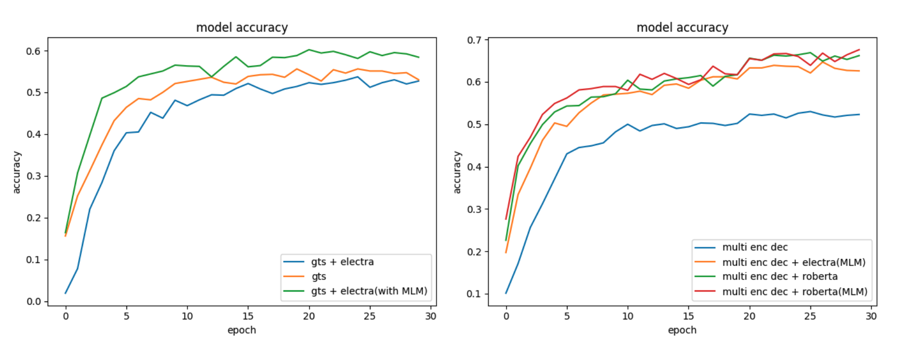
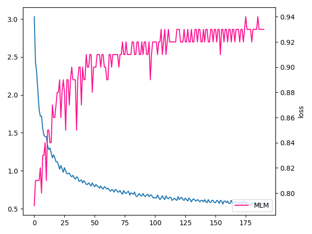

## 인공지능 그랜드 챌린지 5차

## Silver IRIS

- 인공지능을 활용하여 텍스트로 구성된 서술형 수학문제의 풀이과정과 해답을 제시하라
- Algebraic 모델과 Question Answering 모델로 구성
- binary classification을 통해 문제를 구분하여 각 모델로 전달

### Algebraic model

- 중국어 수학 문제 데이터셋 [Math23k](https://ai.tencent.com/ailab/nlp/dialogue/#Dataset), [Ape210k](https://github.com/Chenny0808/ape210k) 를 기계번역을 통하여 데이터셋 구축
- 2가지 모델을 비교
    - [A Goal-Driven Tree-Structured Neural Model for Math Word Problems](https://github.com/ShichaoSun/math_seq2tree) (gts)에 [kykim electra-kor-base](https://huggingface.co/kykim/electra-kor-base) 를 임베딩으로 사용한 모델
    - [Solving Math Word Problems with Multi-Encoders and Multi-Decoders](https://github.com/YibinShen/MultiMath) (multi)에 [KLUE roberta-large](https://huggingface.co/klue/roberta-large) 를 임베딩으로 사용한 모델.
    - MLM은 같은 데이터셋에 masked language modeling을 통해 pretraining한 모델을 의미
 

- 추가적인 실험으로 [Bert](https://aclanthology.org/N19-1423/)에서 사용한 NSP(Next Sentence Prediction)을 적용한 roberta model 비교 예정

### Question Answering model
- Question Answering으로 풀 수 있는 형식의 데이터셋 [DROP](https://allennlp.org/drop), [KorQUAD](https://korquad.github.io/) 을 기계번역을 통하여 데이터셋 구축

| |exact match|f1 score|
|------|---|---|
|epoch 1|60.424|63.578|
|epoch 2|78.092|80.300|
|epoch 3|84.100|86.249| 

### Scripts
- main.py : 인공지능 그랜드 챌린지 제출 형식의 파일
- mwp_train.py : Algebraic 모델 학습 파일
- qa_train.py : Question Answering 모델 학습 파일
- pretraining : mathmatical pretrain 학습 디렉토리

